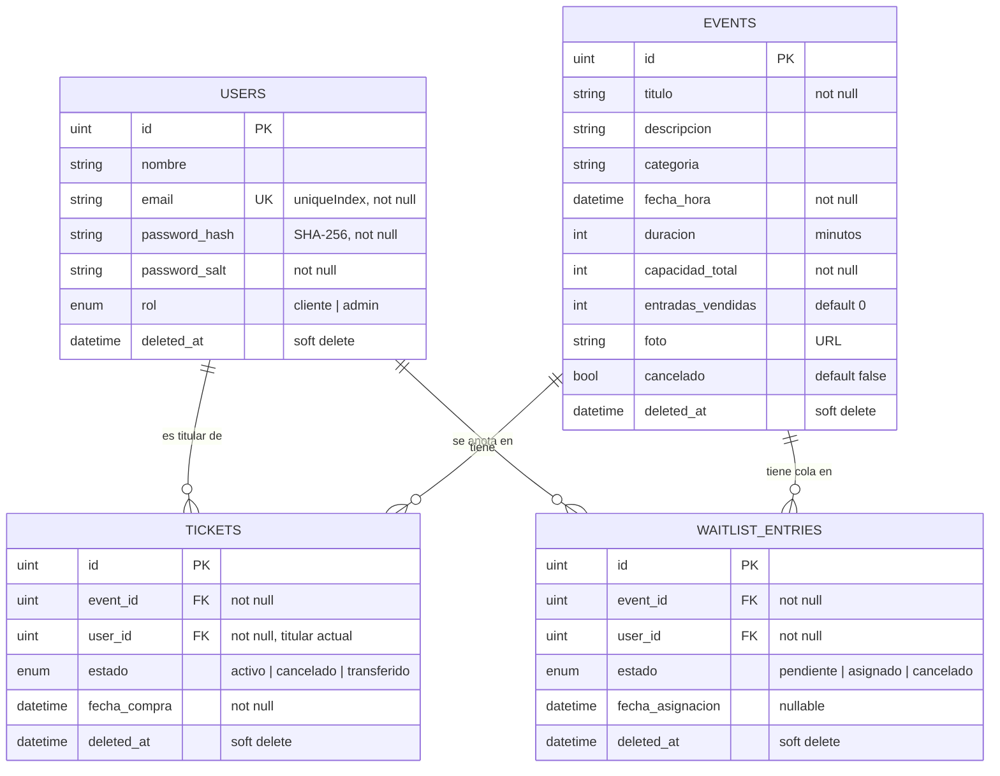
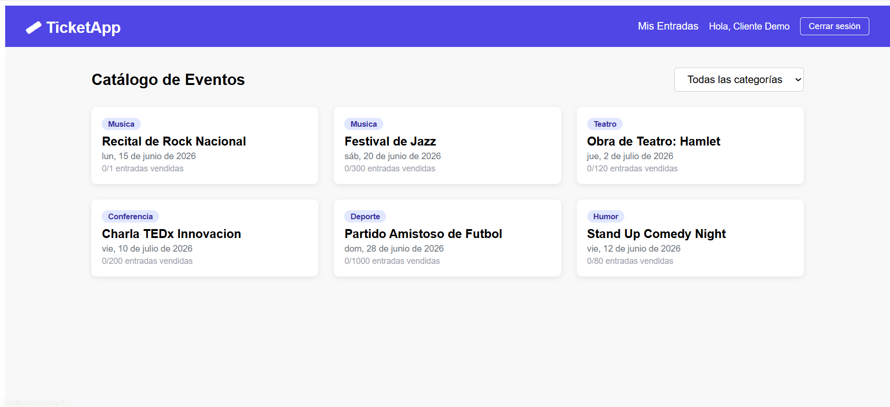
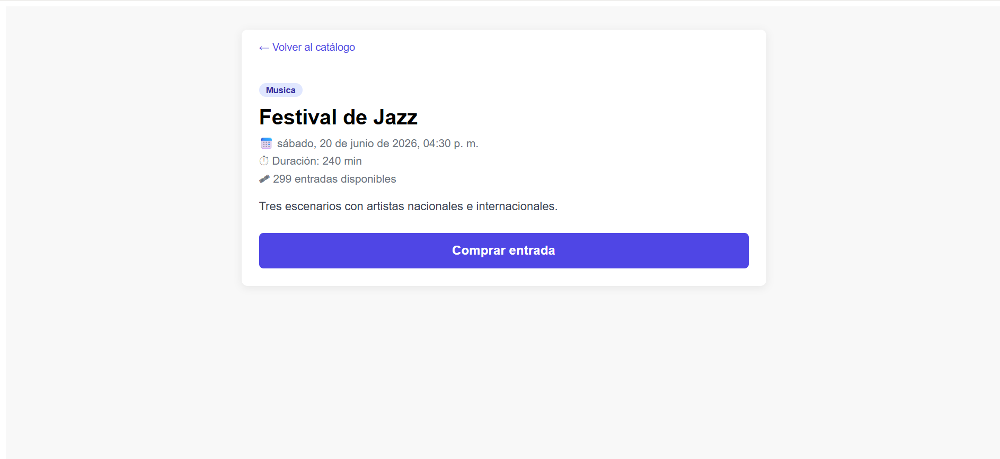
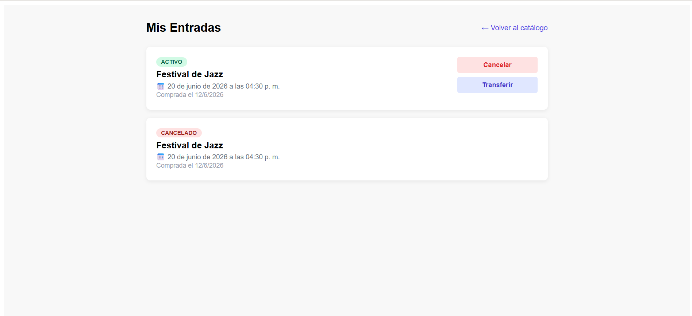
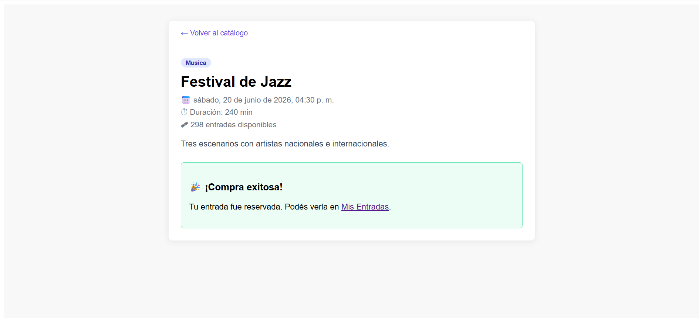
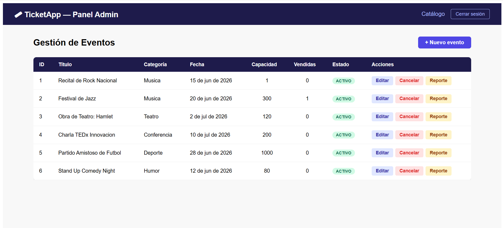
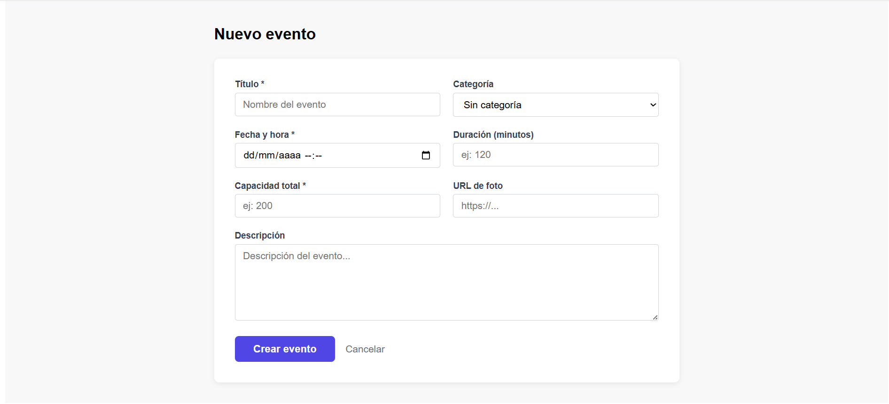
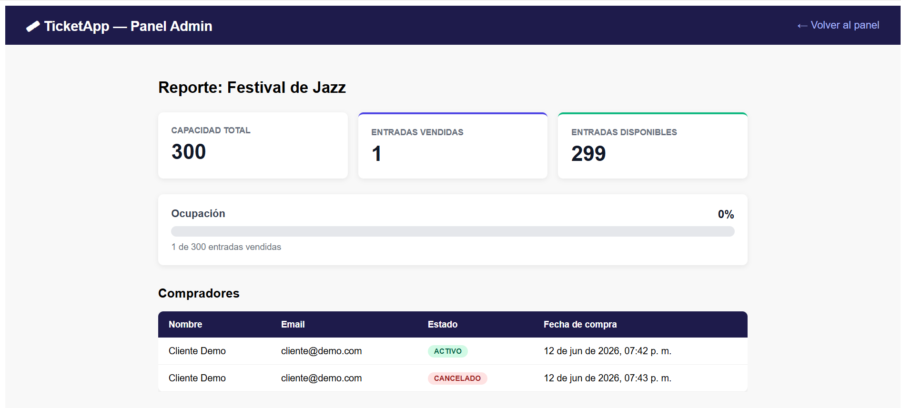

# Sistema de Gestión de Eventos y Entradas

Trabajo integrador — Desarrollo de Software 2026 (UCC, Facultad de Ingeniería).

Sistema tipo *Ticketek* para la gestión de eventos y venta de entradas. Expone una API REST en **Go** consumida por una SPA en **React**, ambas desacopladas. Soporta dos roles:

- **Cliente:** explora el catálogo de eventos, ve el detalle, compra entradas, consulta "Mis Entradas", cancela una compra y transfiere una entrada a otro usuario.
- **Administrador:** crea, edita y cancela eventos, y consulta reportes de ocupación y ventas.

## Tabla de Contenidos

- [Tecnologías Utilizadas](#tecnologías-utilizadas)
- [Prerrequisitos](#prerrequisitos)
- [Levantar con Docker (recomendado)](#levantar-con-docker-recomendado)
- [Levantar sin Docker](#levantar-sin-docker)
- [Variables de entorno](#variables-de-entorno)
- [Endpoints disponibles](#endpoints-disponibles)
- [Testing](#testing)
- [Crear un usuario administrador](#crear-un-usuario-administrador)
- [Diagrama de Base de Datos](#diagrama-de-base-de-datos)
- [Capturas de pantalla](#capturas-de-pantalla)
- [Decisiones de diseño](#decisiones-de-diseño)
- [Estructura](#estructura)

## Tecnologías Utilizadas

### Backend
- **Go** (>= 1.26) — lenguaje principal.
- **Gin** (`github.com/gin-gonic/gin`) — router y framework HTTP.
- **GORM** (`gorm.io/gorm` + `gorm.io/driver/mysql`) — ORM y mapeo de entidades.
- **JWT** (`github.com/golang-jwt/jwt/v5`) — autenticación y autorización por roles.
- **MySQL 8** — motor de base de datos relacional.
- **testify** + `net/http/httptest` — testing unitario y de integración.

### Frontend
- **React** + **Vite** — librería de UI y bundler/dev server.
- **React Router** — ruteo del lado cliente (SPA).
- **Axios** — cliente HTTP hacia la API.

### DevOps
- **Docker** + **Docker Compose** — contenedorización de los tres servicios (frontend, backend y base de datos).
- **Nginx** — sirve el build estático del frontend con fallback de SPA.

## Prerrequisitos

- Go >= 1.26
- Node >= 20
- Docker + Docker Compose (para levantar todo junto)
- MySQL 8 (si corrés sin Docker)

## Levantar con Docker (recomendado)

```bash
cp .env.example .env        # completar JWT_SECRET y DB_PASSWORD
docker compose up --build
```

- Frontend: http://localhost
- Backend:  http://localhost:8080
- Health:   http://localhost:8080/health

> La primera vez que levanta, GORM crea las tablas automáticamente vía `AutoMigrate`. No hace falta crear nada en SQL.

## Levantar sin Docker

### Base de datos
Levantá MySQL 8 localmente y creá la base de datos:
```sql
CREATE DATABASE eventos_db;
```

### Backend
```bash
cd backend
cp .env.example .env   # completar con tus datos locales
go mod tidy
go run .
```

### Frontend
```bash
cd frontend
cp .env.example .env
npm install
npm run dev
```

## Variables de entorno

| Variable     | Descripción                        | Ejemplo         |
|--------------|------------------------------------|-----------------|
| DB_HOST      | Host de MySQL                      | localhost       |
| DB_PORT      | Puerto MySQL                       | 3306            |
| DB_USER      | Usuario MySQL                      | root            |
| DB_PASSWORD  | Contraseña MySQL                   | secret          |
| DB_NAME      | Nombre de la base de datos         | eventos_db      |
| JWT_SECRET   | Secreto para firmar los tokens JWT | clave_secreta   |
| PORT         | Puerto del backend                 | 8080            |

## Endpoints disponibles

### Auth (público)
| Método | Ruta              | Descripción                        |
|--------|-------------------|------------------------------------|
| POST   | /auth/register    | Registrar usuario nuevo            |
| POST   | /auth/login       | Login, devuelve JWT                |

### Eventos (público, sin token)
| Método | Ruta          | Descripción                          |
|--------|---------------|--------------------------------------|
| GET    | /events       | Catálogo (filtro opcional `?categoria=`) |
| GET    | /events/:id   | Detalle de un evento                 |

El endpoint `GET /events` acepta un filtro opcional por categoría:
```
GET /events?categoria=musica
```
Si no se indica categoría, devuelve todos los eventos no cancelados. El filtro se aplica directamente en la consulta SQL, no en memoria.

### Tickets (protegido)
| Método | Ruta                     | Descripción                          |
|--------|--------------------------|--------------------------------------|
| POST   | /tickets                 | Comprar entrada (valida cupo)        |
| GET    | /tickets/mine            | Mis entradas                         |
| DELETE | /tickets/:id             | Cancelar entrada (libera/reasigna cupo) |
| PUT    | /tickets/:id/transfer    | Transferir entrada a otro usuario    |

Al cancelar una entrada, el sistema resta 1 a `EntradasVendidas` en el evento (liberando el cupo) y cambia el estado del ticket a `cancelado`. El ticket no se elimina — queda en la base de datos para mantener el historial.

### Lista de espera (protegido)
| Método | Ruta                     | Descripción                          |
|--------|--------------------------|--------------------------------------|
| POST   | /events/:id/waitlist     | Anotarse en la lista de espera (solo si el evento está agotado) |
| GET    | /waitlist/mine           | Mis anotaciones y asignaciones       |

### Administrador (protegido, requiere rol admin)
| Método | Ruta                     | Descripción                          |
|--------|--------------------------|--------------------------------------|
| POST   | /events                  | Crear nuevo evento                   |
| PUT    | /events/:id              | Actualizar datos de un evento        |
| PATCH  | /events/:id/cancel       | Cancelar un evento                   |
| GET    | /events/:id/report       | Reporte de ocupación y compradores   |

> Estos endpoints requieren un usuario con rol `admin` y cuentan con sus vistas en el frontend (Panel de gestión, Formulario de evento y Reportes). Se acceden iniciando sesión con un usuario administrador; el token viaja en el header `Authorization: Bearer <token>`.

### Health
| Método | Ruta      | Descripción                        |
|--------|-----------|-------------------------------------|
| GET    | /health   | Estado del servidor y conexión DB  |

### Usar el token JWT
Todos los endpoints protegidos requieren el header:
```
Authorization: Bearer <token>
```

## Testing

Las pruebas se concentran en las capas de **servicios** (lógica de negocio) y **controladores** (respuestas HTTP con `httptest`), cubriendo casos de éxito y de error (compra sin cupo, acceso sin token, cancelación de ticket ajeno, etc.).

```bash
cd backend
go test ./...                                                                 # correr todos los tests
go test ./... -cover                                                          # cobertura por paquete
go test ./... -coverprofile=coverage.out && go tool cover -func=coverage.out  # cobertura total
go tool cover -html=coverage.out                                              # ver cobertura en el navegador
go vet ./... && gofmt -l .                                                    # lint básico
```

Objetivo de cobertura: **40%** para regularidad y **80%** para el examen final, sobre servicios y controladores.

## Crear un usuario administrador

La app solo permite registrar usuarios con rol `cliente`. Para crear un admin:

1. Registrá el usuario normalmente desde la app (esto genera el hash de contraseña correctamente).
2. Abrí MySQL Workbench, buscá la tabla `users` y cambiá el campo `rol` de `cliente` a `admin` para ese usuario.

## Diagrama de Base de Datos

El esquema se crea y mapea íntegramente con **GORM** (`AutoMigrate` + structs con tags), sin SQL crudo. Las relaciones se configuran con claves foráneas reales (`foreignKey` / `references`).

El siguiente diagrama entidad-relación se renderiza directamente en GitHub. La fuente está versionada en [`docs/er-diagram.mmd`](docs/er-diagram.mmd).



> Además de los campos mostrados, cada entidad hereda `id`, `created_at`, `updated_at` y `deleted_at` del `gorm.Model` embebido. El detalle completo está en [`docs/er-diagram.mmd`](docs/er-diagram.mmd).

## Capturas de pantalla

> Las imágenes se encuentran en [`docs/screenshots/`](docs/screenshots/).

### Cliente
| Catálogo de eventos | Detalle del evento |
|---------------------|--------------------|
|  |  |

| Mis Entradas | Compra exitosa |
|--------------|----------------|
|  |  |

### Administrador
| Panel de gestión de eventos | Formulario de evento |
|-----------------------------|----------------------|
|  |  |

| Reporte de ocupación y ventas |
|-------------------------------|
|  |

## Decisiones de diseño

### Borrado de registros: Soft Delete

Las tres entidades principales (`User`, `Event`, `Ticket`) usan **soft delete** en lugar de borrado físico.

Esto significa que al "eliminar" un registro, GORM no ejecuta un `DELETE` en la base de datos. En cambio, escribe la fecha y hora actual en la columna `deleted_at`. Las consultas normales filtran automáticamente los registros con `deleted_at IS NOT NULL`, haciéndolos invisibles para la aplicación, pero el dato sigue existiendo en la tabla.

Este comportamiento viene del `gorm.Model` embebido en cada struct, que agrega cuatro columnas automáticamente:

```
id           → clave primaria autoincremental
created_at   → fecha de creación
updated_at   → fecha de última modificación
deleted_at   → NULL mientras existe; fecha de borrado si fue eliminado (soft delete)
```

**Por qué lo elegimos:**
- **Integridad referencial:** un `Ticket` siempre puede mostrar los datos del `Event` al que pertenece, aunque ese evento se haya cancelado. Si borráramos el evento físicamente, el ticket quedaría huérfano.
- **Auditoría:** se conserva el historial completo de eventos y compras, útil para reportes.
- **Cancelación de eventos:** marcar `Cancelado = true` en el evento comunica el estado de negocio; el soft delete protege el registro histórico.

**Implicancia práctica:** si se necesita consultar registros borrados (p. ej. para un reporte de eventos cancelados), se puede usar `db.Unscoped()` en GORM para ignorar el filtro de `deleted_at`.

### Hashing de contraseñas: SHA-256 + salt

Las contraseñas **nunca** se almacenan en texto plano. En el registro se genera un **salt** aleatorio por usuario y se guarda el hash **SHA-256** de `password + salt` (campos `password_hash` y `password_salt`). En el login se recalcula el hash con el salt almacenado y se compara.

**Por qué lo elegimos:**
- El enunciado admite MD5 o SHA-256; optamos por SHA-256 por ser más robusto frente a colisiones.
- El **salt único por usuario** evita que dos usuarios con la misma contraseña produzcan el mismo hash y mitiga ataques con *rainbow tables*.
- La contraseña en plano no sale nunca de la capa de autenticación ni se loguea. La lógica de hashing vive aislada en `utils`.

### Autenticación y autorización con JWT

La sesión se maneja con un **token JWT firmado** (secreto en `JWT_SECRET`) que incluye los claims `user_id`, `rol` y `exp` (expiración). Un middleware de Gin valida el token en cada request protegida; para los endpoints de administrador, además valida que el `rol` sea `admin`.

**Por qué lo elegimos:**
- Permite una API **stateless**: el servidor no guarda sesiones, todo viaja firmado en el token.
- El `user_id` del titular se toma **siempre del token**, nunca de un parámetro del cliente. Así "Mis Entradas" y las operaciones sobre tickets solo afectan al usuario autenticado, evitando que alguien opere sobre datos ajenos.
- La separación entre **autenticación** (¿quién sos?) y **autorización** (¿podés hacer esto?) permitió entregar primero el flujo de Cliente (regularidad) y sumar la validación de roles de Admin después (final) sin reescribir la base.

## Estructura

```
backend/   → API REST en Go (Gin + GORM)
frontend/  → SPA en React + Vite
docs/      → Diagrama de BD y documentación
```

### Lista de espera (bonus)

Cuando un evento está agotado, un usuario puede anotarse en la lista de espera. Al cancelarse una entrada, si hay alguien esperando, el cupo liberado no vuelve al stock: se le crea automáticamente un ticket activo al primero de la lista (FIFO por fecha de anotación) y su anotación pasa a `asignado`. Solo si la lista está vacía se decrementa `EntradasVendidas`.
